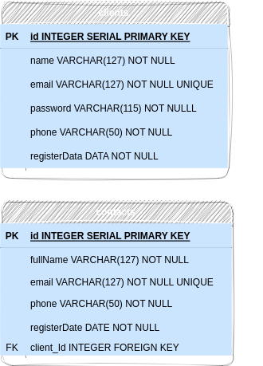

  

    <strong
      >Readme.md</strong
    >
  

  <h1>
    Cadastro de Clientes e Contatos
  </h1>
  <h2>
    Introdução
  </h2>
  

    Neste desafio, foi criado uma aplicação web que permita cadastrar
        clientes e seus contatos vinculados. Além disso, a aplicação fornece um relatório em tela ou exportado
        em PDF que mostre os dados do cliente e seus contatos.
  

  <h2>
    Tecnologias Utilizadas
  </h2>
  <ul>
    <li>
      <a href="https://www.typescriptlang.org/" target="_new"
        >TypeScript</a
      >
    </li>
    <li>
      <a href="https://nodejs.org/en/" target="_new"
        >Node.js</a
      >
    </li>
    <li>
      <a href="https://www.postgresql.org/" target="_new"
        >PostgreSQLName</a
      >
    </li>
    <li>
      <a href="https://expressjs.com/pt-br/" target="_new"
        >Expressar</a
      >
    </li>
    <li>
      <a href="https://typeorm.io/" target="_new"
        >TypeORM</a
      >
    </li>
    <li>
      <a href="https://yarnpkg.com/package/zod" target="_new"
        >Zod</a
      >
    </li>
  </ul>
  <h2>
    Diagrama de Entidade de Relacionamentos (DER)
  </h2>
  

  <h2>
    Configuração e Instalação
  </h2>
  <ol>
    <li>
      Clone o repositório em sua máquina local:
    </li>
  </ol>
  <pre>

bash

<code class="!whitespace-pre hljs language-bash">git clone &lt;link-do-repositorio&gt;
cd desafio-fullstack-junior
</code>

</pre>
  <ol start="2">
    <li>
      Instale as dependências do projeto:
    </li>
  </ol>
  <pre>

<code class="!whitespace-pre hljs">npm install
</code>

</pre>
  <ol start="3">
    <li>
      

        Configure suas variáveis ​​de ambiente copiando o arquivo
          <code>.env.example</code
        >para <code>.env</code
        >e preenchendo com suas credenciais do PostgreSQL e outras
            configurações necessárias.
      

    </li>
    <li>
      

        Execute as migrations para criar as tabelas no banco de
            dados:
      

    </li>
  </ol>
  <pre>

sql

<code class="!whitespace-pre hljs language-sql">npm run typeorm migration:generate src/migrations/create&lt;nome-da-class&gt; -- -d src/data-source.ts
npm exec -- npm run typeorm -- migration:run -d src/data-source.ts
</code>

</pre>
  <h2>
    Terminais
  </h2>
  <h3>
    clientes
  </h3>
  <h4>
    Criação de cliente
  </h4>
  

    Cria um novo cliente no sistema.
  

  <ul>
    <li>
      <strong
        >Método</strong
      > : POST
    </li>
    <li>
      <strong
        >Rota</strong
      > : /clientes
    </li>
  </ul>
  

    Exemplo de solicitação:
  

  <pre>

bash

<code class="!whitespace-pre hljs language-bash">POST /clients
Host: http://localhost:3000
Authorization: None
Content-type: application/json
</code>

</pre>
  

    Corpo da Requisição:
  

  <pre>

json

<code class="!whitespace-pre hljs language-json">{
  "name": "diego",
  "email": "diego@mail.com",
  "phone": "11913455456"
}
</code>

</pre>
  

    Resposta da Requisição:
  

  <pre>

json

<code class="!whitespace-pre hljs language-json">{
  "name": "diego",
  "email": "diego@mail.com",
  "phone": "11913455456",
  "id": 1,
  "registerDate": "2023-08-03T20:14:23.803Z"
}
</code>

</pre>
  <h4>
    Listar Todos os Clientes
  </h4>
  

    Retornar uma lista de todos os clientes cadastrados no sistema.
  

  <ul>
    <li>
      <strong
        >Método</strong
      > : GET
    </li>
    <li>
      <strong
        >Rota</strong
      > : /clientes
    </li>
  </ul>
  

    Exemplo de solicitação:
  

  <pre>

bash

<code class="!whitespace-pre hljs language-bash">GET /clients
Host: http://localhost:3000
Authorization: necessita do token do cliente para acesso
Content-type: application/json
</code>

</pre>
  

    Resposta da Requisição:
  

  <pre>

json

<code class="!whitespace-pre hljs language-json">[
  {
    "name": "diego",
    "email": "diego@mail.com",
    "phone": "11913455456",
    "id": 1,
    "registerDate": "2023-08-03T20:14:23.803Z"
  },
  {
    "name": "michele",
    "email": "michele@mail.com",
    "phone": "1188574531",
    "id": 2,
    "registerDate": "2023-08-03T20:14:25.803Z"
  },
  {
    "name": "luiz",
    "email": "luiz@mail.com",
    "phone": "118836547825",
    "id": 3,
    "registerDate": "2023-08-03T20:14:28.803Z"
  }
]
</code>

</pre>
  <h4>
    Listar Cliente por ID
  </h4>
  

    um cliente Retorna específico pelo seu ID.
  

  <ul>
    <li>
      <strong
        >Método</strong
      > : GET
    </li>
    <li>
      <strong
        >Rota</strong
      > : /clientes/:id
    </li>
  </ul>
  

    Exemplo de solicitação:
  

  <pre>

bash

<code class="!whitespace-pre hljs language-bash">GET /clients/:id
Host: http://localhost:3000
Authorization: necessita do token do cliente para acesso
Content-type: application/json
</code>

</pre>
  

    Resposta da Requisição:
  

  <pre>

json

<code class="!whitespace-pre hljs language-json">{
  "client": {
    "name": "diego",
    "email": "diego@mail.com",
    "phone": "11913455456",
    "id": 1,
    "registerDate": "2023-08-03T20:14:23.803Z"
  },
  "contacts": [
    {
      "id": 2,
      "fullName": "michele Oliveira",
      "email": "michele@mail.com",
      "phone": "1188574531",
      "registerDate": "2023-08-03T20:14:25.803Z"
    }
  ]
}
</code>

</pre>
  <h4>
    Atualizar Cliente por ID
  </h4>
  

    Atualiza os dados de um cliente específico pelo seu ID.
  

  <ul>
    <li>
      <strong
        >Método</strong
      > : PATCH
    </li>
    <li>
      <strong
        >Rota</strong
      > : /clientes/:id
    </li>
  </ul>
  

    Exemplo de solicitação:
  

  <pre>

bash

<code class="!whitespace-pre hljs language-bash">PATCH /clients/:id
Host: http://localhost:3000
Authorization: necessita do token do cliente para acesso
Content-type: application/json
</code>

</pre>
  

    Corpo da Requisição:
  

  <pre>

json

<code class="!whitespace-pre hljs language-json">{
  "name": "diego Oliveira",
  "email": "diego123@mail.com"
}
</code>

</pre>
  

    Resposta da Requisição:
  

  <pre>

json

<code class="!whitespace-pre hljs language-json">{
  "name": "diego Oliveira",
  "email": "diego123@mail.com",
  "phone": "11913455456",
  "id": 1,
  "registerDate": "2023-08-03T20:14:23.803Z"
}
</code>

</pre>
  <h4>
    Excluir cliente por ID
  </h4>
  

    Deletar um cliente específico pelo seu ID.
  

  <ul>
    <li>
      <strong
        >Método</strong
      > : DELETE
    </li>
    <li>
      <strong
        >Rota</strong
      > : /clientes/:id
    </li>
  </ul>
  

    Exemplo de solicitação:
  

  <pre>

bash

<code class="!whitespace-pre hljs language-bash">DELETE /clients/:id
Host: http://localhost:3000
Authorization: necessita do token do cliente para acesso
Content-type: application/json
</code>

</pre>
  

    Resposta da Requisição:
  

  <pre>

scss

<code class="!whitespace-pre hljs language-scss">204 No Content (nenhum corpo retornado para resposta)
</code>

</pre>
  <h3>
    Contatos
  </h3>
  <h4>
    Criação de Contato
  </h4>
  

    Cria um novo contato associado a um cliente.
  

  <ul>
    <li>
      <strong
        >Método</strong
      > : POST
    </li>
    <li>
      <strong
        >Rota</strong
      > : /contatos
    </li>
  </ul>
  

    Exemplo de solicitação:
  

  <pre>

bash

<code class="!whitespace-pre hljs language-bash">POST /contacts
Host: http://localhost:3000
Authorization: necessita do token do cliente para acesso
Content-type: application/json
</code>

</pre>
  

    Corpo da Requisição:
  

  <pre>

json

<code class="!whitespace-pre hljs language-json">{
  "fullName": "michele Oliveira",
  "phone": "95164220",
  "email": "michele@mail.com"
}
</code>

</pre>
  

    Resposta da Requisição:
  

  <pre>

json

<code class="!whitespace-pre hljs language-json">{
  "fullName": "michele Oliveira",
  "email": "michele@mail.com",
  "phone": "95164220",
  "id": 2,
  "registerDate": "2023-08-03T20:25:56.111Z"
}
</code>

</pre>
  <h4>
    Listar Todos os Contatos
  </h4>
  

    Retornar uma lista de todos os
  

  <ul>
    <li>
      <strong
        >Método</strong
      > : GET
    </li>
    <li>
      <strong
        >Rota</strong
      > : /contatos
    </li>
  </ul>
  

    Ex
  

  <pre>

vbnet

<code class="!whitespace-pre hljs language-bash">
Host: http://localhost:3000

Host

Content
GET /contacts
Host: http://localhost:3000
Authorization: necessita do token do cliente para acesso
Content-type: application/json
</code>

</pre>
  

    Resposta da Requisição:
  

  <pre>

json

<code class="!whitespace-pre hljs language-json">[
  {
    "fullName": "michele Oliveira",
    
   
"email": "michele@mail.com",
    "phone": "95164220",
    "id": 2,
    "registerDate": "2023-08-03T20:25:56.111Z"
  },
  {
    "fullName": "luiz Oliveira",
    
   
"email": "luiz@mail.com",
    "phone": "9516321320",
    "id": 3,
    "registerDate": "2023-08-03T20:43:57.233Z"
  }
]
</code>

</pre>
  <h4>
    Listar Contato por ID
  </h4>
  

    um retorna contato espec
  

  <ul>
    <li>
      <strong
        >Método</strong
      > : GET
    </li>
    <li>
      <strong
        >Rota</strong
      > : /contatos/:id
    </li>
  </ul>
  

    Exemplo de solicitação:
  

  <pre>

sql

<code class="!whitespace-pre hljs language-bash">GET /contacts/:id
Host: http://localhost:3000
Authorization: necessita 
Host: http://localhost:3000
Authorization:

Host: http://localhost:3000
Authorization

Host: http://localhost:3000
do token do cliente para acesso
Content-type: application/json

``
</code>

</pre>
  

    res
  

  <pre>

json

<code class="!whitespace-pre hljs language-json">{
  "fullName": "luiz Oliveira",
  
 
"email": "luiz@mail.com",
  "phone": "9516321320",
  
 
"id": 3,
  
 
"registerDate": "2023-08-03T20:43:57.233Z",
  "client": {
    "name": "diego",
    
   
"email": "diego@mail.com",
    "phone": "219821626",
    "id": 1,
    "registerDate": "2023-08-03T20:35:49.907Z"
  }
}
</code>

</pre>
  <h4>
    Atualizar Contato
  </h4>
  

    Atualiza os dados de um contato específico
  

  <ul>
    <li>
      <strong
        >Método</strong
      > : PATCH
    </li>
    <li>
      <strong
        >Rota</strong
      > : /contatos/:id
    </li>
  </ul>
  

    Ex
  

  <pre>

bash

<code class="!whitespace-pre hljs language-bash">PATCH /contacts/:id
Host: http://localhost:3000
Authorization: necessita 
Host
do token do cliente para acesso
Content-
Content
type: application/json
</code>

</pre>
  

    cor
  

  <pre>

json

<code class="!whitespace-pre hljs language-json">{
  "fullName": "luiz sousa",
  
 
"email": "luiz123@mail.com"
}
</code>

</pre>
  

    Resposta da Requisição:
  

  <pre>

json

<code class="!whitespace-pre hljs language-json">{
  
 
"fullName": "luiz sousa",
  "email": "luiz123@mail.com",
  "phone": "9516321320",
  "id": 3,
  "registerDate": "2023-08-03T20:43:57.233Z"
}
</code>

</pre>
  <h4>
    Excluir contato por ID
  </h4>
  

    De
  

  <ul>
    <li>
      <strong
        >Método</strong
      > : DELETE
    </li>
    <li>
      <strong
        >Rota</strong
      > : /contatos/:id
    </li>
  </ul>
  

    Exemplo de solicitação:
  

  <pre>

bash

<code class="!whitespace-pre hljs language-bash">DELETE /contacts/:id
Host: http://localhost:3000
Authorization: necessita 
Host: http://localhost:3000
Authorization:

Host: http://localhost:3000

Host
do token do cliente para acesso
Content-type: application/json
</code>

</pre>
  

    Resposta da Requisição
  

  <pre>

scss

<code class="!whitespace-pre hljs language-scss">204 No Content (nenhum corpo retornado para resposta)
</code>

</pre>
  <h2>
    Testes (opcional)
  </h2>
  

    Para executar os testes
  

  <pre>

<code class="!whitespace-pre hljs language-arduino">npm run test
</code>

</pre>
  